# Testing

Three steps are required for utilizing REST API resources:

*   [Authenticate the user](http://www.magentocommerce.com/api/rest/authentication/oauth_authentication.html "OAuth Authentication") (receive the access token for further steps);
*   Configure the [permissions for operations](http://www.magentocommerce.com/api/rest/permission_settings/roles_configuration.html "REST Roles Configuration") and [attributes](http://www.magentocommerce.com/api/rest/permission_settings/attributes_configuration.html "REST Attributes Configuration") for the type of the user;
*   Make an API call.

The following headers are required for the call:

*   Authorization
*   Version
*   Accept
*   Content-type

The following parameters must be provided in the Authorization header for the call:

*   `oauth\_signature\_method`
*   `oauth\_version`
*   `oauth\_nonce`
*   `oauth\_timestamp`
*   `oauth\_consumer\_key`
*   `oauth\_token`
*   `oauth\_signature`

#### Testing REST resources with the [REST Client](https://addons.mozilla.org/en-US/firefox/addon/restclient/) plugin for the Mozilla Firefox browser.

1.  Open the REST Client.
2.  From the Authentication drop-down, select **OAuth**.  
    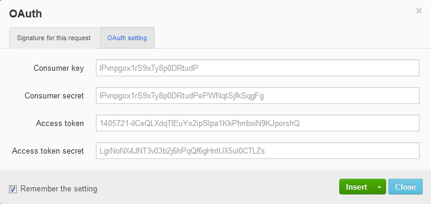
3.  In the OAuth window, on the Signature for the request tab, fill in the following fields:
    *   **Consumer key**: Enter the **Key** value provided when you created the consumer in Magento Admin Panel.
    *   **Consumer secret**: Enter the **Secret** value provided when you created the consumer in Magento Admin Panel.
    *   **Access token**: Enter the `oauth\_token` value received when you authenticated the application.
    *   **Access token secret**: Enter the `oauth\_token\_secret` value received when you authenticated the application.
4.  On the OAuth setting tab, define the following options: 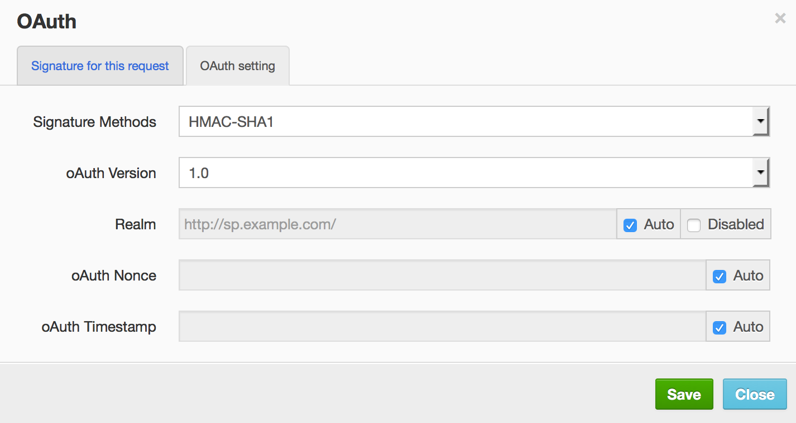
    *   **Signature Methods**: From the drop-down list, select which method will be used for signatures (HMAC-SHA1 or PLAINTEXT).
    *   **OAuth Version**: From the drop-down list, select the **1.0** option (REST API supports OAuth 1.0a).
    *   Leave the **Realm**, **OAuth Nonce**, and **OAuth Timestamp** values set by default.
5.  Click **Save** and wait for the confirmation dialog to close.

6.  Return to the Signature for the request tab and select **Insert > Insert as header**. 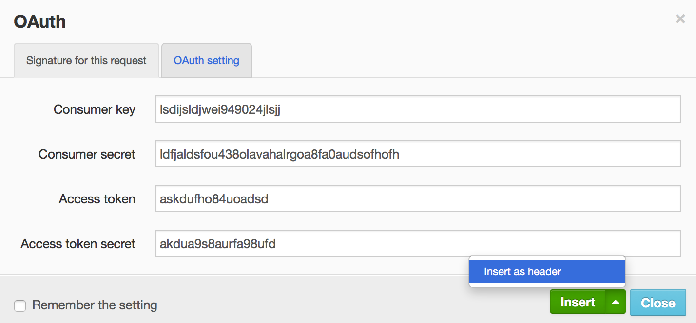

    An authorization header is created on the main page of REST Client.

    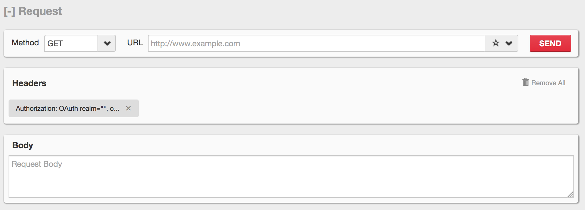
    **NOTE**: Click the header with authorization data and click **Auto refresh** in the opened pop-up in order to generate new values for `oauth\_nonce`, `oauth\_timestamp`, and `oauth\_signature` at each request.  
    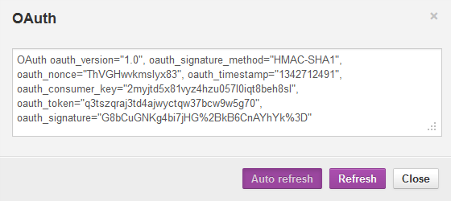11.  From the **Headers** drop-down, select **Custom Header**.  
    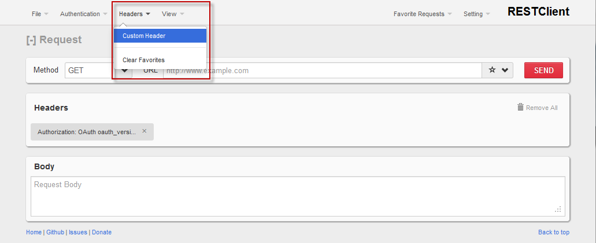
12.  In the **Request Header** window, enter "Content-Type" in the **Name** field and `text/xml` in the **Value** field (if you want to use the XML data format). To use the JSON request data format, enter `application/json` instead of the `text/xml` value.
13.  Click **Okay**.  
     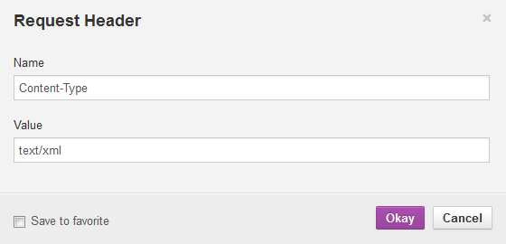

**Example: Retrieving the List of Products**

1.  From the **Method** drop-down list, select the **GET** option.
2.  In the **URL** field, enter the following URL: `https://om.ddev.site/api/rest/products`. You can limit the number of products returned in the response. To set the limit to 4, enter the following URL: `https://om.ddev.site/api/rest/products?limit=4`
3.  Click **Send**. Information about all products will be displayed in the response body. Example is as follows:  
    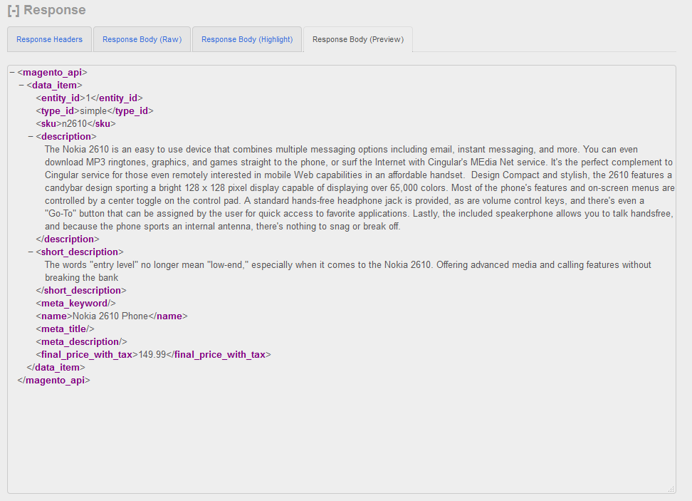

#### Testing REST resources with the [Advanced REST Client](https://chrome.google.com/webstore/detail/hgmloofddffdnphfgcellkdfbfbjeloo) for Google Chrome browser.

1.  Open the Advanced REST Client Application.  
    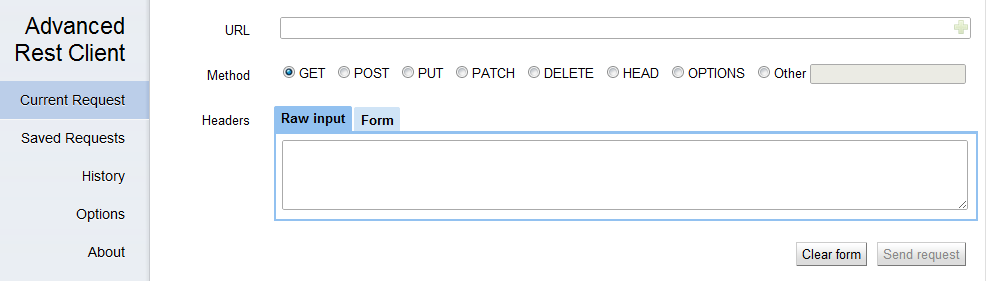
2.  In the **Headers** box, select the **Form** tab.
3.  In the first field, start typing _authorization_. An **Authorization** popup appears. Click it.  
    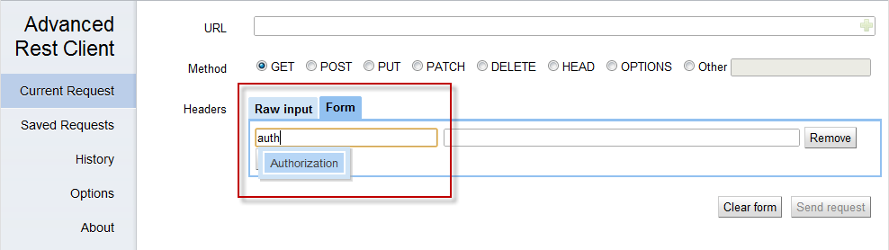
4.  When you click the fields next to the Authorization header, the **Construct** link appears. Click it to configure OAuth authentication.
5.  The Authorization window opens. Select the OAuth tab.  
    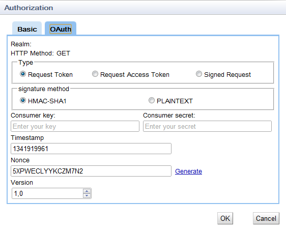
6.  In the **Type** group of options, select the **Signed Request** option.
7.  In the **signature method** group of options, select which method will be used for signatures (HMAC-SHA1 or PLAINTEXT).
8.  Fill in the following data:  
    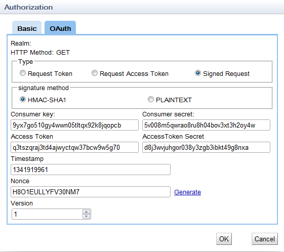
    *   **Consumer key**: Enter the **Key** value provided when you created the consumer in Magento Admin Panel.
    *   **Consumer secret**: Enter the **Secret** value provided when you created the consumer in Magento Admin Panel.
    *   **Access Token**: Enter the `oauth\_token` value received when you authenticated the application.
    *   **Access Token Secret**: Enter the `oauth\_token\_secret` value received when you authenticated the application.
9.  Click **OK**.  
    **NOTE**: Advanced REST Client does not save the **Consumer secret** and **Access Token Secret** values. You need to enter these values each time you make a request.
10.  In the **URL** field, enter the URL to which the API call will be performed and select the required HTTP method.
11.  In the **Headers** table, click **Add row** and add the `Accept - application/json` or `Accept - text/xml` header depending on which format you prefer for the returned data.
12.  Click **Send Request**.

**Example: Retrieving the list of customers**

1.  In the **Method** group of options, select the **GET** option.
2.  In the URL field, enter the following URL: `https://om.ddev.site/api/rest/customers`.
3.  Click **Send request**. Information about all customers will be displayed in the response body. Note that only Admin type of the user can retrieve the list of customers. Example is as follows:  
    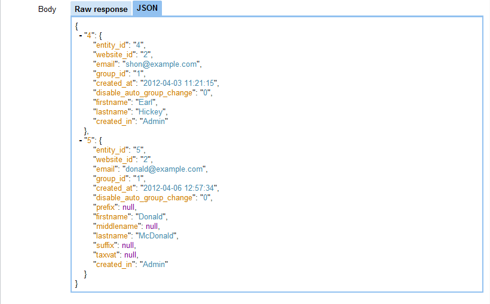

**Example: Creating a customer address**

1.  In the **Method** group of options, select the **POST** option.
2.  In the URL field, enter the following URL: `https://om.ddev.site/api/rest/customers/:id/addresses` where the ":id" value is the customer ID in the system.
3.  In the **Body** table, on the **Raw input** tab, enter the data required for customer address creation.
4.  Click **Send request**. If the address is created, the 200 OK HTTP status code will be returned. Example is as follows:  
    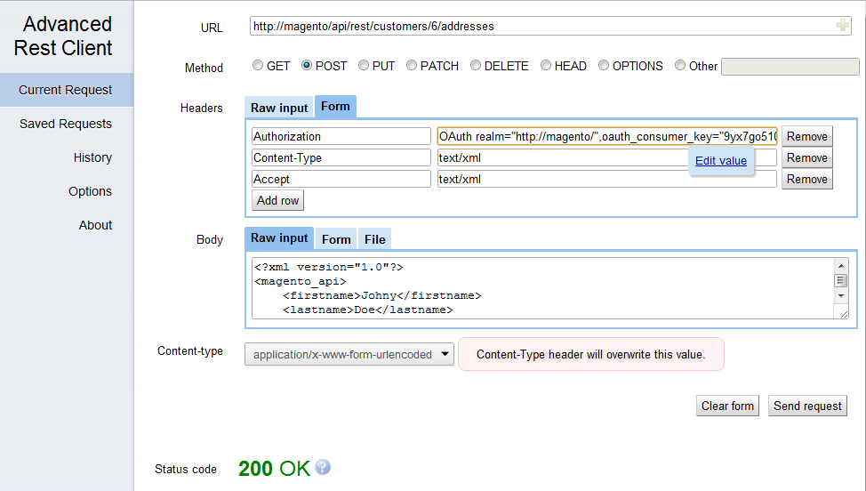