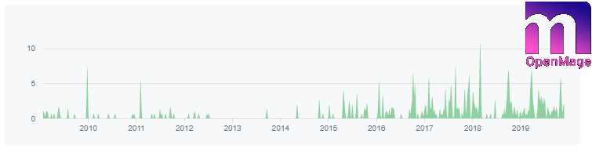

# New Release 19.4.0

We are happy to announce the first independent Release of OpenMage.
To avoid confusion with past and future Magento Releases, we are starting with the Version 19.4.0 [^1].

<!-- more -->

On the one side this reflects that we include everything from Magento 1.9.4.3  
On the other side, it reflects our intent, to base the Major Version on the current year.

This Release does not yet contain all changes needed to properly support PHP 7.4 as they are still in the Review, but they should be ready with the next release.

The Version 19 will be an LTS Version with indefinite Lifetime, but at least 5 Years.  
It will ensure a maximum on backwards compatibility to Magento 1.

The next LTS version will be released in the beginning of 2023 and be version 23 and have again 5 years of lifetime.
Besides this, we will have a yearly major release with around 2 years of lifetime for the Users, who want to try out new Features earlier.

[^1]: Release [v19.4.0](https://github.com/OpenMage/magento-lts/releases/tag/v19.4.0)
