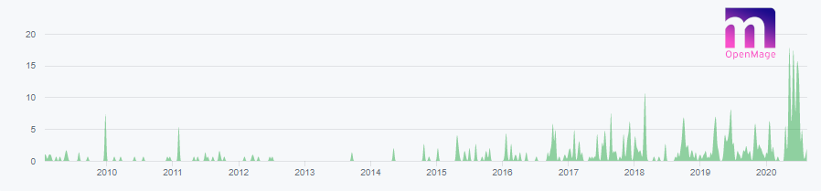

# New Release 19.4.6 and 20.0.2

Our Release Today marks a new and Important Milestone for the OpenMage Project.
Not even 2 Months since the end of life for Magento 1, we are now shipping the first Security Patch, which is not included in the official Magento 1 Release.

<!-- more -->

The Patch is shipped as part of our new released Versions 19.4.6 [^1] and 20.0.2 [^2].

The CVE for the related vulnerability is CVE-2020-15151 [^3], and we had a little help here from Adobe, as they fixed a comparable vulnerability in Magento2 with their latest release.
While having your attention, let me also make you aware of our process to submit security vulnerabilities, which can be found at [SECURITY.md](https://github.com/OpenMage/magento-lts/blob/main/.github/SECURITY.md){:target="_blank"}

Also, a big **Thank You** to the hosting providers who work together with us and support us in finding and solving security related Issues.

[^1]: https://github.com/OpenMage/magento-lts/releases/tag/v19.4.6
[^2]: https://github.com/OpenMage/magento-lts/releases/tag/v20.0.2
[^3]: https://github.com/advisories/GHSA-crf2-xm6x-46p6
